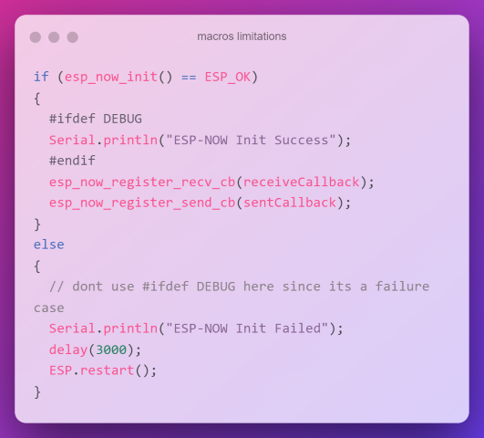

# Vehicle Telematics control unit graduation project ❤️✊

### Rules:
- Commits messages must be subjective, put some time and effort now to save more later

- Codes comments are a must, Please read these:
  - https://doxygen.nl/manual/docblocks.html
 - a helpful extension for comments in vscode : 
 https://marketplace.visualstudio.com/items?itemName=cschlosser.doxdocgen

- its always preferable to use pre-processor macros
  
  

  - https://www.programiz.com/c-programming/c-preprocessor-macros
  - however, always print errors "voteable" -->

- All functions names must follow conventions and must be descriptive

- Each part of the project is a module, a module is put in a separate repository, each repository is a submodule in a main repository for its team

- Each team has a main repository, each is a submodule in a bigger repository for all teams

- Write a document about your module, how to use it with other modules, and show each interface function targeted for usage in other modules

- Add all references you used at the bottom of your repository readme file or in a separate file called references.md

- ### you are responsible for updating your own submodule repositories in your main module repository every once in a while "only with stable commits please 😊"

## Latest SW Blocks

##
##

## Embedded Architecture

## Enjoy coding ❤️❤️❤️👾🤖☕❤️❤️❤️

# Important links for the team
- https://docs.google.com/spreadsheets/d/1WbfK3yT8CKUa9XLJAY0uV2J-8GQ59V-iXHWHUBHUDOo/edit#gid=371635279

- https://docs.google.com/document/d/1b1ADjoqi36Q1cHuUJx2l1BNtXIE6LbiIufjHbuFZ644/edit?usp=sharing

- https://www.figma.com/file/hxYmTw2ZEgo9Ml4tEko2eo/Properties-List?node-id=0%3A1&t=5Wiplc1bSbYU29Rz-0
